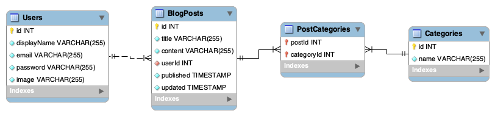
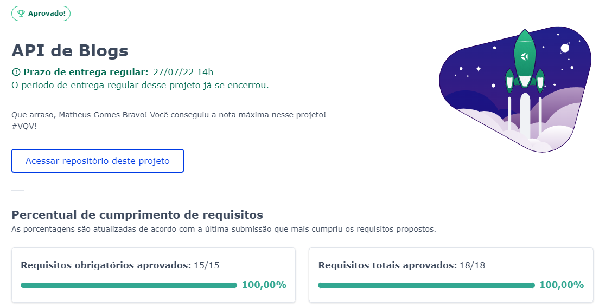

# Blogs API



Nesse projeto foi desenvolvido um serviço RESTful de um blog com arquitetura MSC.

A conexão com o banco de dados foi feita usando ORM Sequelize, autenticação com JWT e o banco de dados é o postgres hospedado no supabase.

[Aqui](https://mgb-blogsapi.herokuapp.com/docs/) você consegue ver o funcionamento da API via swagger.

Arquivo .json do swagger disponibilizado por [Raphael Martins](https://www.linkedin.com/in/raphaelameidamartins/)

## Ferramentas utilizadas:

  - [Swagger](https://swagger.io/)
  - [Sequelize](https://sequelize.org/)
  - [JWT](https://jwt.io/)
  - [Postgres](https://www.postgresql.org/)
  - [Supabase](https://supabase.com/)
  - [NodeJS](https://nodejs.org/)
  - [Express](https://expressjs.com/)
  - [Joi](https://www.npmjs.com/package/joi)
  - [Docker](https://www.docker.com/)
  - [Heroku](https://www.heroku.com/)

## Como utilizar a aplicação:

Você pode consumir os endpoints pela URL https://mgb-blogsapi.herokuapp.com

É necessário que faça login para acessar os endpoints.

Você pode utilizar:

```
{
  "email": "lewishamilton@gmail.com",
  "password": "123456"
}
```

Ou criar um novo no endpoint POST /user com:

```
{
  "displayName": "Seu nome",
  "email": "seuemail@email.com",
  "password": "senhaCom6DigitosOuMais",
  "image": "urlDaImagemDoUsuario"
}
```

e depois fazer login em POST /login.


## Nota

